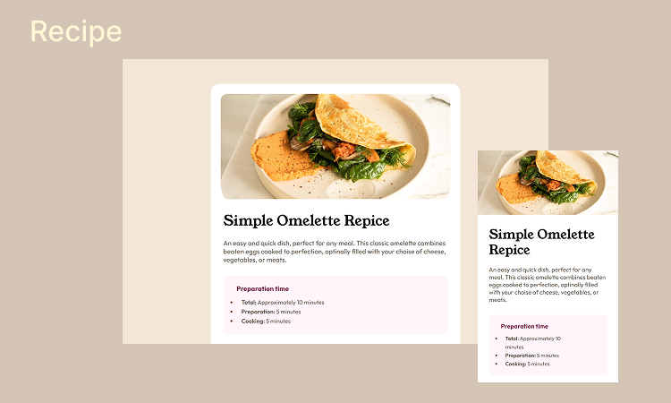

<h1 align="center"> Simple Omelette Recipe </h1>

  

 

## 🚀 Tecnologias

Esse projeto foi desenvolvido com as seguintes tecnologias:

- HTML 
- CSS
- Front end Mentor

 

## 💻 Projeto
Programa exclusivo e gratuito, promovido pelo Front-end Mentor para ensino de tecnologias WEB.

 

## 🔖 Layout

 

## 🌐 Acesse o projeto
👉 [recipe](https://erika-nicolly.github.io/DevLinks/#)

 

link original: (https://www.frontendmentor.io/challenges/recipe-page-KiTsR8QQKm)